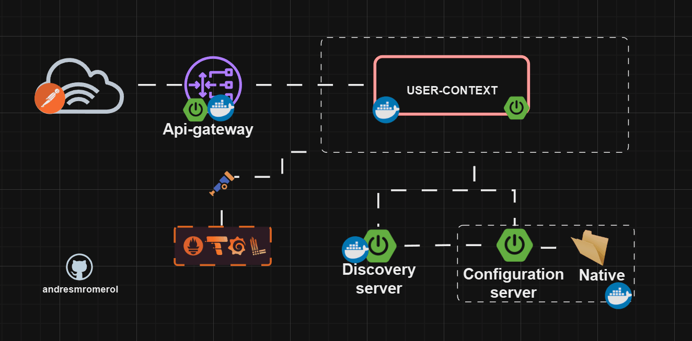

# spring-microservices-architectures-patterns-testing-ddd-events-eda-cqrs-saga-cicd-docker-kubernetes

---
## 🔗 Hi, I'm Andrés Romero! 👋
 
andresmromerolopez@gmail.com  - andresandresmromero7@gmail.com

---

  

| **Component**            | **Description**                                                                                                                                                                                                                                             |
|--------------------------|-------------------------------------------------------------------------------------------------------------------------------------------------------------------------------------------------------------------------------------------------------------|
| **Discovery Server**     | It registers microservices and allows them to discover each other to facilitate communication.   **TechStack:** Spring Boot, Eureka Server, Prometheus and Spring Actuator                                                                               |
| **Configuration Server** | It manages and distributes configuration settings to microservices to ensure consistency and centralized management.   **TechStack:** Spring Boot, Spring Actuator, OpenTelemetry and Prometheus                                                         |
| **Gateway**              | It acts as a single entry point for client requests and routes them to the appropriate microservices.   **TechStack:** Spring Boot, Spring Actuator, OpenTelemetry and Prometheus |
| **User-context**         | **TechStack:** Spring Boot |
|                          |                                                                                                                                                                                                                                                             |
| **Observability**        | **TechStack:** OpenTelemetry, Loki, Tempo, Prometheus and Grafana                                                                                                                                                                                           |